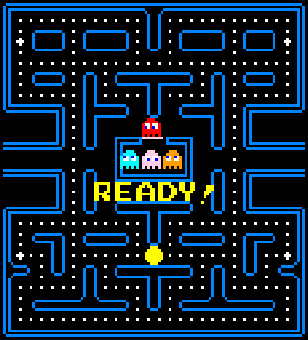

## Pac-a-Ball

A simple Pacman game based on the Unity Roll a Ball tutorial developed in the 7th semester of  
computer engineering, Insper (2023.2). 

Access the game and play online: https://leticiacb.itch.io/pack-a-ball

### 🏆️ Goal
The objective of the game is to collect all 178 pickups 
spread across the map before the 2min timer expires and 
dodge enemies (4 balls representing the ghosts).  

### 🎮️ How To Play

* Use the arrow keys or the A-W-S-D keys to move the ball.
  
* To collect items (PickUps), just touch them.
  
* The player starts with 3 lives. 
 
* If the player touches an enemy (ghost), the player's 
life is taken and he returns to his position at the 
beginning of the game.

### 📌️ Credits

* Music Effects  

[UnityPacmania](https://github.com/stuart73/UnityPacmania/tree/master)

* Tutorials used as inspiration

[Make a Minimap](https://www.youtube.com/watch?v=28JTTXqMvOU)

[UnityPacmania](https://github.com/stuart73/UnityPacmania/tree/master)

[Make a game over screen](https://www.youtube.com/watch?v=VbZ9_C4-Qbo)

[Add Image and Textures](https://www.youtube.com/watch?si=-W_AGFp1EyI45CjF&v=lcd_lXG0XxI&feature=youtu.be)

[Create a countdown timer](https://www.youtube.com/watch?v=hxpUk0qiRGs)

[AI navigation](https://www.youtube.com/watch?si=BEnvYHaAT1VzOnWz&v=u2EQtrdgfNs&feature=youtu.be)

[Unity Roll a Ball tutorial](https://learn.unity.com/project/roll-a-ball)

[Respawn Point Tutorial](https://www.youtube.com/watch?si=blEvU1nQRvxKhC4T&v=tBj-FWcIwYw&feature=youtu.be)

[Moving Background](https://www.youtube.com/watch?si=gUYCRioA-a-8URJS&v=lF26yGJbsQk&feature=youtu.be)

